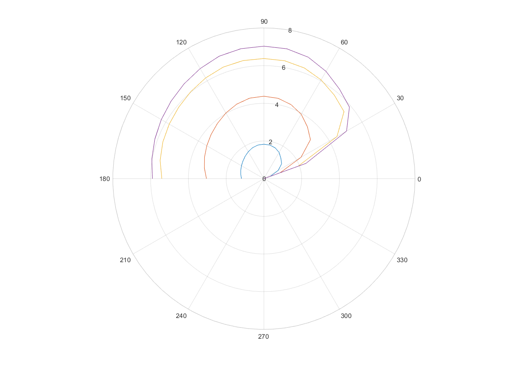
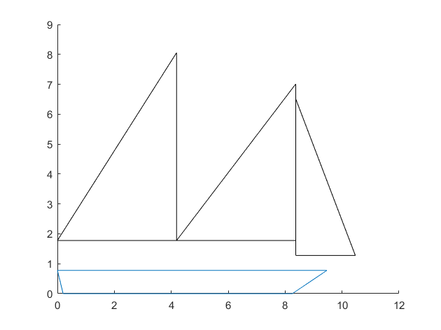

# vpp
Sailboat Velocity Prediction Program

Program to predict the speed of a sailboat at a given wind speed and direction. The VPP is based off of the vpp outlined by Lars Larsson in Princibles of Yacht Design. It was written largely by me for our team's use in my Ocean Engineering senior design project.

The vpp was based on the flow chart below. It is essentialy an iterative method to find the speed at which the resistant forces acting on the hull of the sailboat balance with the propulsive forces generated by the sail.

The VPP outputs a nice graph like the one below as well as tabulated data detailing the boat's performance at various wind speeds and directions.

